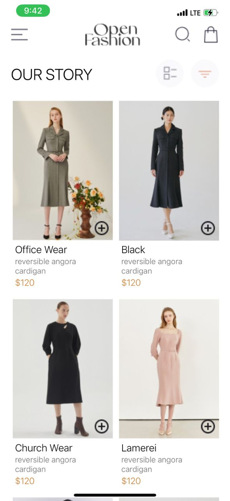
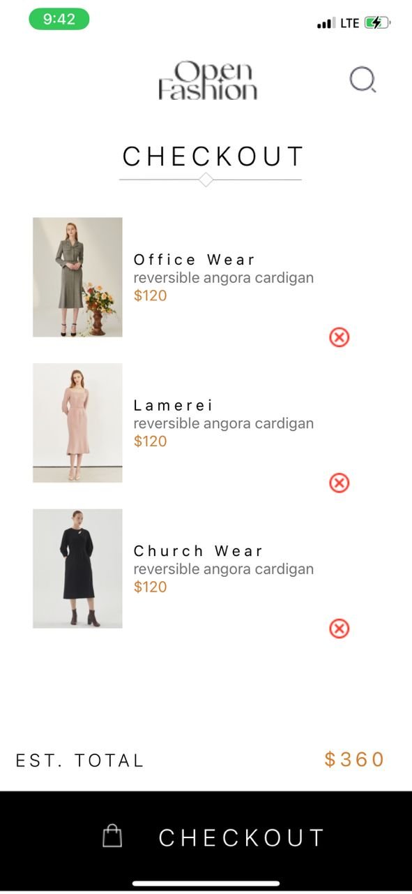

# RN Assignment 6

## Description
This React Native application allows users to view a list of products, add products to a shopping cart, and remove products from the cart. The cart data is stored locally on the device using AsyncStorage.

## Design Choices
- **Navigation:** Used React Navigation to handle screen transitions between HomeScreen and CartScreen.
- **Local Storage:** Used AsyncStorage for persistent storage of cart data.
- **UI Design:** Followed the provided UI mockup to design the screens.

## Implementation
- **HomeScreen:** Displays available products with an "Add to cart" button.
- **CartScreen:** Displays selected items with a "Remove from cart" button.
- **Local Storage:** Used AsyncStorage to save and load cart data.

## Screenshots
-
-

## How to Run
1. Clone the repository.
2. Navigate to the project directory.
3. Install dependencies: `npm install`
4. Run the app: `npx react-native run-android` or `npx react-native run-ios`

